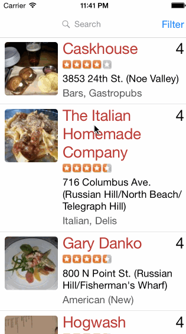

#### How many hours did it take to complete?

About 12 hours

#### Stories

- [x] Build a Yelp search results page
- [x] Table rows should be dynamic height, with auto layout constraints
- [x] Search bar should be in the navigation bar
- [x] Create a filter page using filters supported by the Yelp API
  - [x] Category
  - [x] Sort
  - [x] Radius
  - [ ] Deals (not enough room in the UI, and we don't want ads anyway... =/)
- [x] The filters page should be organized into sections
- [x] Submittin the search dismisses the fitlers page and triggers a new search

#### GIF Walkthrough

#### Open source software used:

* [Cocoa Pods][1]
* [AFNetworking][2]
* [MBProgressHUD][3]

#### License

[MIT](License)

[1]: http://cocoapods.org/
[2]: http://afnetworking.com/
[3]: https://github.com/matej/MBProgressHUD
